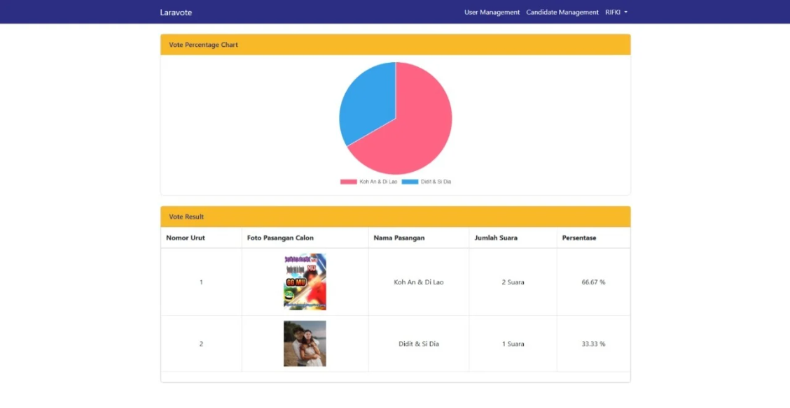
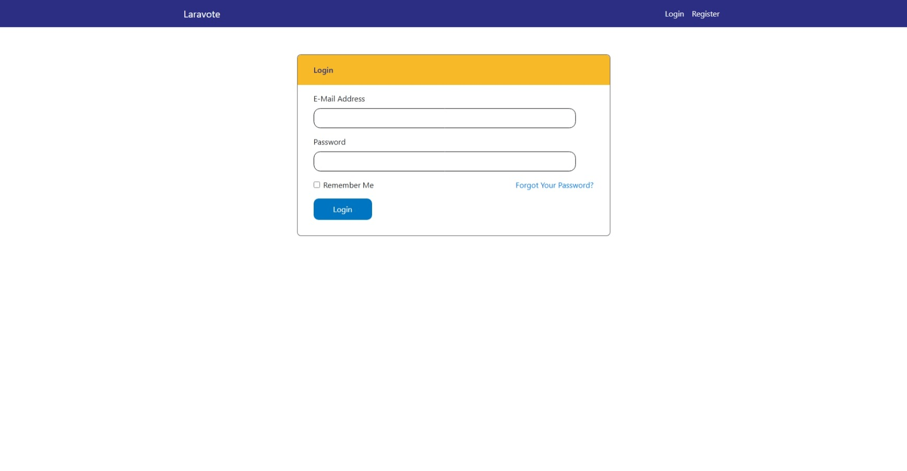
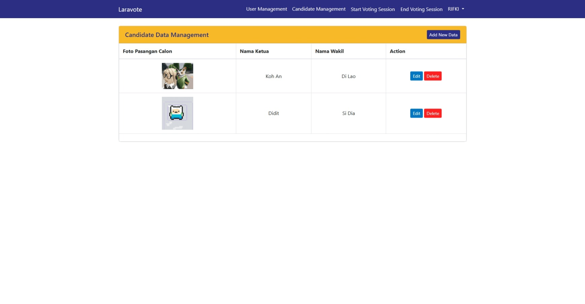
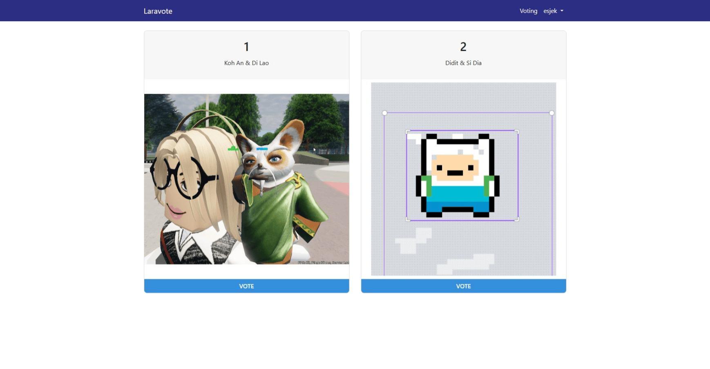

# 🗳️ Laravote - DevOps Voting Application



**Laravote** is a web-based voting platform enhanced with DevOps best practices and full CI/CD pipeline implementation. This project integrates modern software development workflows including automated testing, containerized deployment, monitoring, and role-based feature control.

Want to dive deeper into our technical documentation?  
👉 [Read Full Docs Here (Bahasa Indonesia)](https://intip.in/DOCUMENTATIONLARAVOTE)

---

## 🌟 Features

### Voting System Capabilities
- 🔐 **Token-Based Voting** - Ensure each voter gets one secure, validated vote
- 🧭 **Role-based Access** - Separate flows for Admin and Voters
- 📊 **Real-Time Results** - Vote result visualization with charts
- 🎨 **Improved UI/UX** - Fully redesigned front-end interface using Blade + Bootstrap
- 🛠️ **Admin Panel** - Manage candidates, view tokens, and monitor progress

---

## 🏗️ Technology Stack
### CI/CD PIPELINE WORKFLOW


### Backend
- **Laravel 5.x** (PHP Framework)
- **PHP 7.x**
- **MySQL** - Relational database
- **Composer** - PHP dependency manager

### Frontend
- **Blade Template Engine**
- **Bootstrap** + **Custom CSS**

### Infrastructure
- **Azure Virtual Machine (VM)**
- **Docker & Docker Compose**

### Development & Testing
- **Git + GitHub**
- **GitHub Actions** (CI/CD)
- **PHPUnit** - Unit & feature testing
- **SonarQube / SonarCloud** - Code quality & test coverage

### Monitoring
- **Prometheus** - Metrics collection
- **Grafana** - Real-time dashboard
---

## 🚀 Getting Started

### Prerequisites
- PHP 7.x
- Composer
- Docker & Docker Compose
- MySQL
- Node.js (for frontend assets)

### Setup Guide

1. **Clone the Repository**
```bash
git clone https://github.com/farrelputras/laravote_devops.git
cd laravote_devops
```

2. **Install Dependencies**
```bash
composer install
npm install && npm run dev
```

3. **Configure Environment**
```bash
cp .env.example .env
php artisan key:generate
```

4. **Run Migration & Seed**
```bash
php artisan migrate --seed
```

5. **Start Local Development**
```bash
php artisan serve
```

6. **Or Use Docker**
```bash
docker-compose up --build -d
```

---

## 📡 API Documentation

| Method | Endpoint                      | Description                   |
|--------|-------------------------------|-------------------------------|
| GET    | `/home`                       | Landing Page and Visualization|
| GET    | `/users`                      | User List                     |
| POST   | `/users                       | Add New User                  |
| GET    | `/users/{id}`                 | Show User Detail              |
| PUT    | `/users/{id}`                 | Update User Details           |
| DELETE | `/users/{id}`                 | Delete User                   |
| PUT    | `/users/{id}/pilih'           | User Enable Voting            |
| PUT    | `/users/{id}/toggle-eligible' | User Enable Voting            |
| POST   | `/voting/session`             | Start Voting Session          |
| POST   | `/voting/session/end`         | End Voting Session            |
| GET    | `/candidate`                  | Candidate List                |
| POST   | `/candidate`                  | Add New Candidate             |
| GET    | `/candidate/{id}`             | Show Detail Candidate         |
| PUT    | `/candidate/{ID}`             | Update Candidate Details      |
| DELETE | `/candidate/{id}`             | Delete a Spesific Candidate   |
| POST   | `/login`                      | Authenticate User             |
| POST   | `/logut`                      | Logout Account                |


More available in the full [API Docs](https://intip.in/DOCUMENTATIONLARAVOTE)

---

## 🔁 DevOps & CI/CD Pipeline

### 🔧 Continuous Integration (CI)
GitHub Actions runs on every `push` and `pull request`:
- 🧪 Unit & Feature Testing (PHPUnit)
- 📈 Code Coverage + Smell Report (SonarCloud)

### 🛠 Continuous Deployment (CD)
Deployment pipeline includes:
- 🐳 Build Docker image
- 📦 Push to Azure VM (via SSH)
- ⚙️ Laravel setup: migrate DB, set permissions
- 🔁 Zero-downtime deploy with container orchestration

### 🖥 Monitoring System
- 📊 Azure Monitoring & Grafana: live metrics dashboard
---

## 🌐 Live Demo

Visit: [http://20.106.186.136:8080](http://20.106.186.136:8080)  
🔐 Login Admin:  
- Email: `rifki@admin.com`  
- Password: `admin`

---

## 👥 Project Contributors

Final Project Group 9 – PSO C  
- Ivena Sabita W. (5026221014)  
- Fernandio Farrel P. S. (5026221102)  
- Faiz Musyaffa R. (5026221153)  
- M. Geresidi Rachmadi (5026221163)

---

## 📎 Repositories & Resources

- 🔗 [Laravote DevOps Repo](https://github.com/farrelputras/laravote_devops)
- 🔗 [Original Laravote Source](https://github.com/RifkiCS29/laravote)
- 📄 [Documentation](https://intip.in/DOCUMENTATIONLARAVOTE)
- 🎥 [Project Presentation](https://tekan.id/Progress2-Group9-C)

---

# 📚 Original Setup & Detailed Installation Guide


### Built With


---

## Setup

## Github Actions CI/CD Pipeline
This CI/CD pipeline automates testing, code quality scanning, and deployment of the Laravel application to a remote Virtual Machine (VM).

1. **Workflow Files**:
   - `.github/workflows/test.yml`: Executes testing, code analysis, and SonarCloud scan.
   - `.github/workflows/deploy.yml`: Deploys the application to the VM on successful test completion.

2. **Pipeline Stages:**
   - ### 🧪 Test & Analyze (`test.yml`)
     - Runs on every push or pull request to the `master` branch.
     - Steps:
       - Sets up MySQL service.
       - Installs PHP 7.4 and dependencies.
       - Configures `.env` file and generates `APP_KEY`.
       - Waits for MySQL, runs migrations.
       - Executes unit tests using `php artisan test` and `phpunit`.
       - Sets up Java and downloads SonarScanner CLI.
       - Performs manual SonarCloud analysis with `sonar-scanner`.

   - ### 🚀 Deployment (`deploy.yml`)
     - Triggered on:
       - Success of `test.yml` workflow 
     - Steps:
       - SSH into VM and pull the latest code from GitHub.
       - Rebuilds and restarts Docker containers.
       - Initializes `.env` file and config if needed (fresh deploy).
       - Runs database migrations and optional seeder.
       - Sets folder permissions.
       - Reloads or restarts Nginx service.

3. **Secrets Configuration:**
   Add these secrets in your GitHub repository settings:

   - For Test & Analysis:
     - `SONAR_TOKEN` — Token for SonarCloud authentication.

   - For Deployment via SSH:
     - `VM_HOST` — IP address of the VM.
     - `VM_USER` — VM username.
     - `VM_PASSWORD` — VM password.

> 💡 Notes:
> - Ensure your VM is preconfigured with Docker, Docker Compose, and has access to the Laravel project path (`~/laravote_devops`).
> - The pipeline supports both incremental deployments and fresh setup detection.

---
### Screenshots





